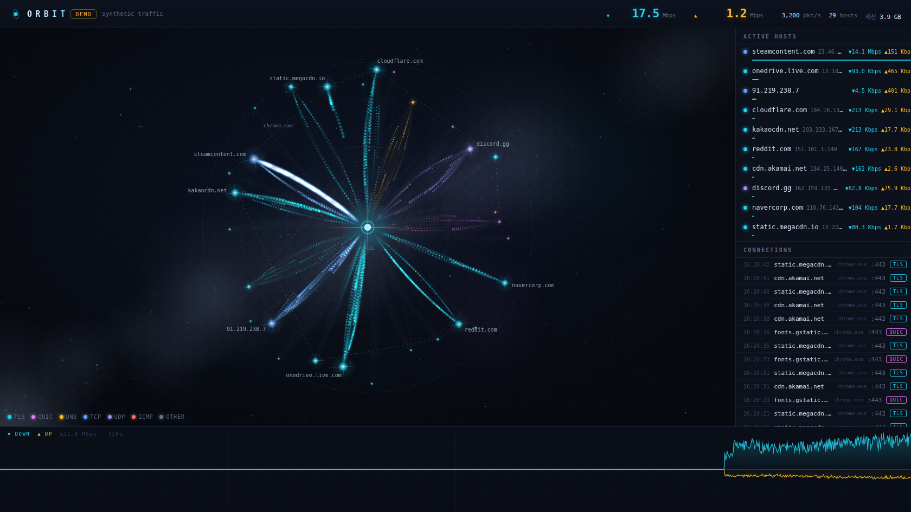

# ◉ Orbit

A real-time network packet observatory — watch the internet orbit your PC as a living galaxy.



- **Windows only** — fully passive capture, so it never touches your network
- **Requires [Npcap](https://npcap.com)** — the live-capture driver (check *WinPcap API-compatible mode* on install)
- Run: double-click `run.bat` → it requests admin automatically → opens in a chromeless app window
- Preview: `run.bat --demo` — synthetic traffic, no Npcap or admin needed

Only Python 3.10+ is required; dependencies install themselves on first run.

## Capture interface

Orbit auto-selects the interface that owns your default route (the one online), and the
console prints which one it chose. **If you switch networks (e.g. Ethernet → Wi-Fi), restart
Orbit** — the capture interface and your local IP are fixed at startup. To pick a specific
adapter:

```
run.bat --list-ifaces            # show adapters (no admin needed)
run.bat --iface "Wi-Fi"          # capture on a named adapter
```

## Record & replay

Capture a session to a file and play it back later — replay needs no Npcap or admin.

```
run.bat --record                 # live capture + record to orbit-live-<timestamp>.jsonl
run.bat --demo --record demo.jsonl
run.bat --replay demo.jsonl      # play it back at the original pace
run.bat --replay demo.jsonl --loop
```

Recordings are newline-delimited JSON (one tick per line) and keep their GeoIP/ASN labels.

## GeoIP / ASN

Hosts are labelled with their country and network operator. The lookup is **100% offline** —
on first run Orbit downloads the [DB-IP Lite](https://db-ip.com) databases once into `.geoip/`,
then never makes a per-IP network request. If the download fails (offline), enrichment simply
stays off and capture is unaffected.

<a href='https://db-ip.com'>IP Geolocation by DB-IP</a> (CC BY 4.0).
Country flags use [Twemoji](https://github.com/twitter/twemoji) (CC BY 4.0).
